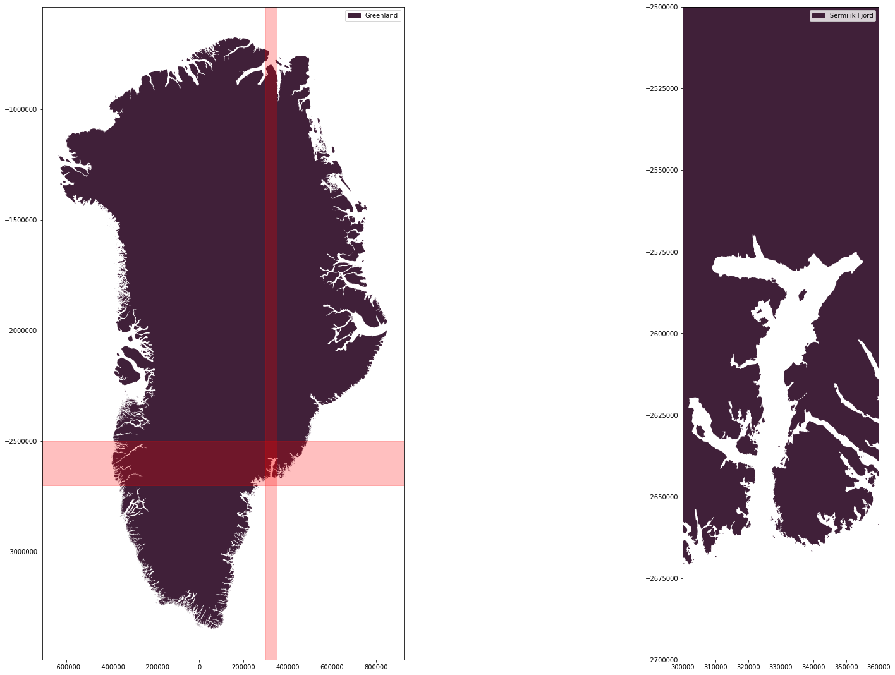
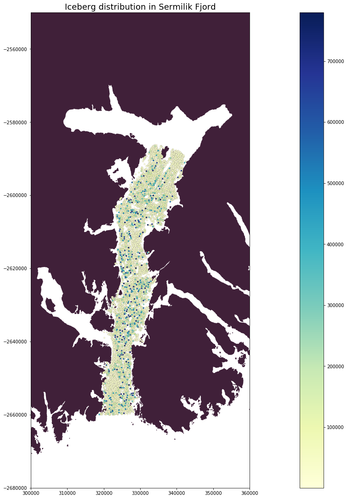
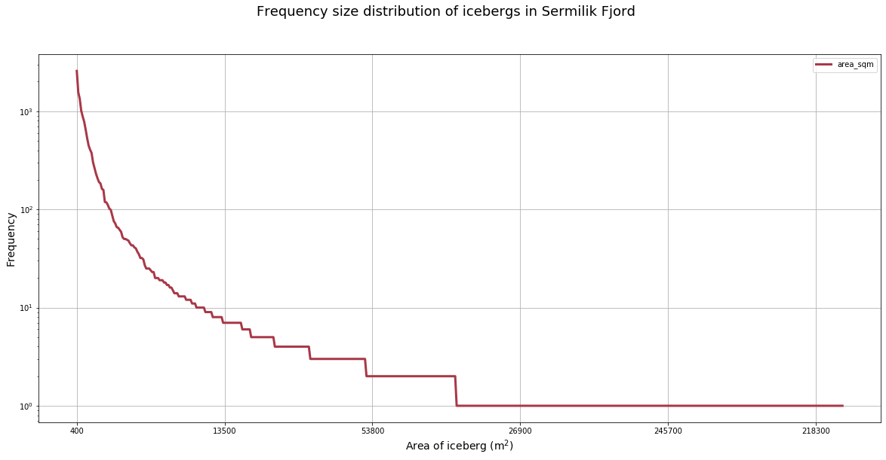
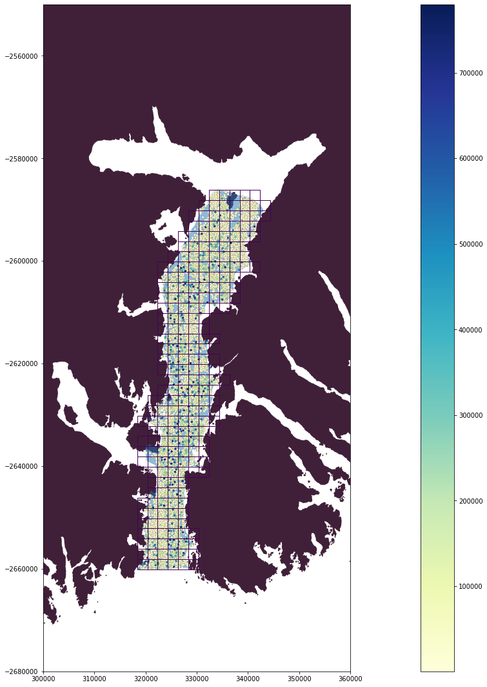
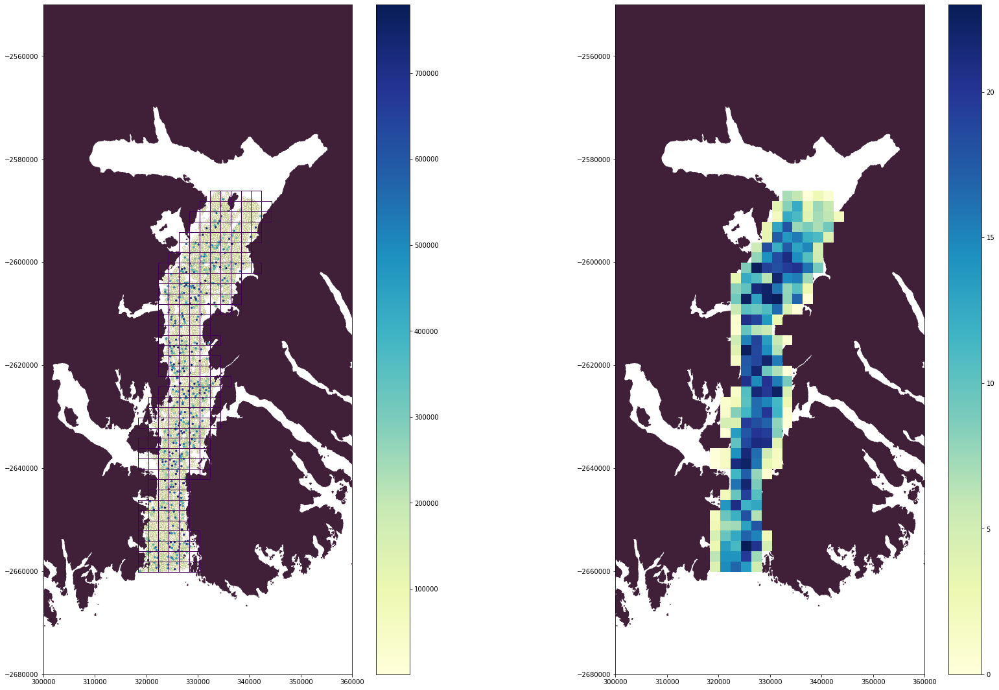

# Analysis of iceberg distribution in Greenland fjord


    GEOG528: Fall 2020,
    Siddharth Shankar,
    Department of Geology,
    University of Kansas


# Libraries


```python
import pandas as pd
import matplotlib.pyplot as plt
import geopandas as gpd
import geoplot as gplt
import matplotlib as mpl
import mpld3

import warnings
warnings.filterwarnings('ignore')

%matplotlib inline
plt.rcParams['figure.figsize'] = (12, 9)
import contextily as ctx

```


```python
%load_ext sql
%sql postgresql://
%config SqlMagic.autopandas=True

```


```python
import ipypostgis
%load_ext ipypostgis
```


```python
import pandas as pd
import rpy2
%matplotlib inline
%reload_ext rpy2.ipython
```


```python
# make PostGIS commands available to this notebook.
path = %env PATH
pg_path = '/usr/lib/postgresql/11/bin/:/usr/lib/postgresql/12/bin/'
if pg_path not in path: path = f'{path}:{pg_path}'
%env PATH=$path
```

    env: PATH=/opt/tljh/user/bin:/usr/local/sbin:/usr/local/bin:/usr/sbin:/usr/bin:/sbin:/bin:/snap/bin:/usr/lib/postgresql/11/bin/:/usr/lib/postgresql/12/bin/


# Objective

__The goal of this project is to analyze iceberg distribution in Sermilik Fjord, South East Greenland. Through this project I want to understand, how the calving processes are impacting Sermilik Fjord (one of the fastest moving glaciers in Greenland) using iceberg distribution.__

__In order to improve the understanding, I will need to perform the following tasks:__

1. Visualize iceberg distribution.
2. Determine the frequency size distribution of icebergs in Sermilik Fjord.
3. Calculate percentage ice-cover within 2km x 2km grid cells in Sermilik Fjord.

# Data Preparation

## List of tables in the project
1. __iceberg_dist:__ Original iceberg table that houses the iceberg data
2. __grid_Sermilik:__ A grid table that houses 2km x 2km polygon grid cells in Sermilik Fjord
3. __overlap_pt_grid:__ A table that captures the point table __(iceberg_dist)__ intersection with grid polygon table __(grid_Sermilik)__
4. __overlap_pt_grid_sum:__ Table that sums areas of all points that are within a grid cell
5. __overlap_pt_grid_percent:__ Table that calculates and holds ice cover percentage per grid cell


## Creating new TABLE called  iceberg_dist


```python
%%sql
DROP TABLE IF EXISTS iceberg_dist; 
CREATE TABLE iceberg_dist (
  id SERIAL,
  Area_sqm decimal,
  x decimal,
  y decimal,
  totalArea decimal,
  PRIMARY KEY (id)
)
```

     * postgresql://
    Done.
    Done.


<div>
<style scoped>
    .dataframe tbody tr th:only-of-type {
        vertical-align: middle;
    }

    .dataframe tbody tr th {
        vertical-align: top;
    }

    .dataframe thead th {
        text-align: right;
    }
</style>
<table border="1" class="dataframe">
  <thead>
    <tr style="text-align: right;">
      <th></th>
    </tr>
  </thead>
  <tbody>
  </tbody>
</table>
</div>


## Copying all the .csv data from ./data directory


```python
!psql -c "\COPY iceberg_dist FROM ./data/S1A_IW_GRDH_1SSH_20160114T085511_20160114T085536_009488_00DC4E_3DA0.tif.csv WITH CSV HEADER;"
```

    COPY 15483


### Viewing the iceberg_dist TABLE after copying all the csv


```python
%%sql
select * from iceberg_dist;
```

     * postgresql://
    15483 rows affected.


<div>
<style scoped>
    .dataframe tbody tr th:only-of-type {
        vertical-align: middle;
    }

    .dataframe tbody tr th {
        vertical-align: top;
    }

    .dataframe thead th {
        text-align: right;
    }
</style>
<table border="1" class="dataframe">
  <thead>
    <tr style="text-align: right;">
      <th></th>
      <th>id</th>
      <th>area_sqm</th>
      <th>x</th>
      <th>y</th>
      <th>totalarea</th>
    </tr>
  </thead>
  <tbody>
    <tr>
      <th>0</th>
      <td>1</td>
      <td>1100</td>
      <td>334165.16864305234</td>
      <td>-2586242.8126422013</td>
      <td>None</td>
    </tr>
    <tr>
      <th>1</th>
      <td>2</td>
      <td>1000</td>
      <td>334102.532279416</td>
      <td>-2586287.176278565</td>
      <td>None</td>
    </tr>
    <tr>
      <th>2</th>
      <td>3</td>
      <td>1100</td>
      <td>334526.07773396146</td>
      <td>-2586311.903551292</td>
      <td>None</td>
    </tr>
    <tr>
      <th>3</th>
      <td>4</td>
      <td>400</td>
      <td>334296.532279416</td>
      <td>-2586374.176278565</td>
      <td>None</td>
    </tr>
    <tr>
      <th>4</th>
      <td>5</td>
      <td>500</td>
      <td>333993.532279416</td>
      <td>-2586383.176278565</td>
      <td>None</td>
    </tr>
    <tr>
      <th>...</th>
      <td>...</td>
      <td>...</td>
      <td>...</td>
      <td>...</td>
      <td>...</td>
    </tr>
    <tr>
      <th>15478</th>
      <td>15479</td>
      <td>400</td>
      <td>323846.532279416</td>
      <td>-2659994.176278565</td>
      <td>None</td>
    </tr>
    <tr>
      <th>15479</th>
      <td>15480</td>
      <td>1600</td>
      <td>322935.282279416</td>
      <td>-2660027.926278565</td>
      <td>None</td>
    </tr>
    <tr>
      <th>15480</th>
      <td>15481</td>
      <td>2500</td>
      <td>321834.732279416</td>
      <td>-2660056.3762785653</td>
      <td>None</td>
    </tr>
    <tr>
      <th>15481</th>
      <td>15482</td>
      <td>700</td>
      <td>321598.6751365588</td>
      <td>-2660054.890564279</td>
      <td>None</td>
    </tr>
    <tr>
      <th>15482</th>
      <td>15483</td>
      <td>800</td>
      <td>321726.532279416</td>
      <td>-2660064.176278565</td>
      <td>None</td>
    </tr>
  </tbody>
</table>
<p>15483 rows × 5 columns</p>
</div>


```python
%%sql
iceberg_df << 
SELECT *
FROM iceberg_dist;
```

     * postgresql://
    15483 rows affected.
    Returning data to local variable iceberg_df


```python
iceberg_df

```


<div>
<style scoped>
    .dataframe tbody tr th:only-of-type {
        vertical-align: middle;
    }

    .dataframe tbody tr th {
        vertical-align: top;
    }

    .dataframe thead th {
        text-align: right;
    }
</style>
<table border="1" class="dataframe">
  <thead>
    <tr style="text-align: right;">
      <th></th>
      <th>id</th>
      <th>area_sqm</th>
      <th>x</th>
      <th>y</th>
      <th>totalarea</th>
    </tr>
  </thead>
  <tbody>
    <tr>
      <th>0</th>
      <td>1</td>
      <td>1100</td>
      <td>334165.16864305234</td>
      <td>-2586242.8126422013</td>
      <td>None</td>
    </tr>
    <tr>
      <th>1</th>
      <td>2</td>
      <td>1000</td>
      <td>334102.532279416</td>
      <td>-2586287.176278565</td>
      <td>None</td>
    </tr>
    <tr>
      <th>2</th>
      <td>3</td>
      <td>1100</td>
      <td>334526.07773396146</td>
      <td>-2586311.903551292</td>
      <td>None</td>
    </tr>
    <tr>
      <th>3</th>
      <td>4</td>
      <td>400</td>
      <td>334296.532279416</td>
      <td>-2586374.176278565</td>
      <td>None</td>
    </tr>
    <tr>
      <th>4</th>
      <td>5</td>
      <td>500</td>
      <td>333993.532279416</td>
      <td>-2586383.176278565</td>
      <td>None</td>
    </tr>
    <tr>
      <th>...</th>
      <td>...</td>
      <td>...</td>
      <td>...</td>
      <td>...</td>
      <td>...</td>
    </tr>
    <tr>
      <th>15478</th>
      <td>15479</td>
      <td>400</td>
      <td>323846.532279416</td>
      <td>-2659994.176278565</td>
      <td>None</td>
    </tr>
    <tr>
      <th>15479</th>
      <td>15480</td>
      <td>1600</td>
      <td>322935.282279416</td>
      <td>-2660027.926278565</td>
      <td>None</td>
    </tr>
    <tr>
      <th>15480</th>
      <td>15481</td>
      <td>2500</td>
      <td>321834.732279416</td>
      <td>-2660056.3762785653</td>
      <td>None</td>
    </tr>
    <tr>
      <th>15481</th>
      <td>15482</td>
      <td>700</td>
      <td>321598.6751365588</td>
      <td>-2660054.890564279</td>
      <td>None</td>
    </tr>
    <tr>
      <th>15482</th>
      <td>15483</td>
      <td>800</td>
      <td>321726.532279416</td>
      <td>-2660064.176278565</td>
      <td>None</td>
    </tr>
  </tbody>
</table>
<p>15483 rows × 5 columns</p>
</div>


```python
%%sql
ALTER TABLE iceberg_dist
ADD COLUMN geom_2 geometry(Point, 3413);
```

     * postgresql://
    Done.


<div>
<style scoped>
    .dataframe tbody tr th:only-of-type {
        vertical-align: middle;
    }

    .dataframe tbody tr th {
        vertical-align: top;
    }

    .dataframe thead th {
        text-align: right;
    }
</style>
<table border="1" class="dataframe">
  <thead>
    <tr style="text-align: right;">
      <th></th>
    </tr>
  </thead>
  <tbody>
  </tbody>
</table>
</div>


```python
%%sql
select * from iceberg_dist
```

     * postgresql://
    15483 rows affected.


<div>
<style scoped>
    .dataframe tbody tr th:only-of-type {
        vertical-align: middle;
    }

    .dataframe tbody tr th {
        vertical-align: top;
    }

    .dataframe thead th {
        text-align: right;
    }
</style>
<table border="1" class="dataframe">
  <thead>
    <tr style="text-align: right;">
      <th></th>
      <th>id</th>
      <th>area_sqm</th>
      <th>x</th>
      <th>y</th>
      <th>totalarea</th>
      <th>geom_2</th>
    </tr>
  </thead>
  <tbody>
    <tr>
      <th>0</th>
      <td>1</td>
      <td>1100</td>
      <td>334165.16864305234</td>
      <td>-2586242.8126422013</td>
      <td>None</td>
      <td>None</td>
    </tr>
    <tr>
      <th>1</th>
      <td>2</td>
      <td>1000</td>
      <td>334102.532279416</td>
      <td>-2586287.176278565</td>
      <td>None</td>
      <td>None</td>
    </tr>
    <tr>
      <th>2</th>
      <td>3</td>
      <td>1100</td>
      <td>334526.07773396146</td>
      <td>-2586311.903551292</td>
      <td>None</td>
      <td>None</td>
    </tr>
    <tr>
      <th>3</th>
      <td>4</td>
      <td>400</td>
      <td>334296.532279416</td>
      <td>-2586374.176278565</td>
      <td>None</td>
      <td>None</td>
    </tr>
    <tr>
      <th>4</th>
      <td>5</td>
      <td>500</td>
      <td>333993.532279416</td>
      <td>-2586383.176278565</td>
      <td>None</td>
      <td>None</td>
    </tr>
    <tr>
      <th>...</th>
      <td>...</td>
      <td>...</td>
      <td>...</td>
      <td>...</td>
      <td>...</td>
      <td>...</td>
    </tr>
    <tr>
      <th>15478</th>
      <td>15479</td>
      <td>400</td>
      <td>323846.532279416</td>
      <td>-2659994.176278565</td>
      <td>None</td>
      <td>None</td>
    </tr>
    <tr>
      <th>15479</th>
      <td>15480</td>
      <td>1600</td>
      <td>322935.282279416</td>
      <td>-2660027.926278565</td>
      <td>None</td>
      <td>None</td>
    </tr>
    <tr>
      <th>15480</th>
      <td>15481</td>
      <td>2500</td>
      <td>321834.732279416</td>
      <td>-2660056.3762785653</td>
      <td>None</td>
      <td>None</td>
    </tr>
    <tr>
      <th>15481</th>
      <td>15482</td>
      <td>700</td>
      <td>321598.6751365588</td>
      <td>-2660054.890564279</td>
      <td>None</td>
      <td>None</td>
    </tr>
    <tr>
      <th>15482</th>
      <td>15483</td>
      <td>800</td>
      <td>321726.532279416</td>
      <td>-2660064.176278565</td>
      <td>None</td>
      <td>None</td>
    </tr>
  </tbody>
</table>
<p>15483 rows × 6 columns</p>
</div>


```python
%%sql
UPDATE iceberg_dist 
SET geom_2 = ST_SetSRID(ST_MakePoint(x, y), 3413);

```

     * postgresql://
    15483 rows affected.


<div>
<style scoped>
    .dataframe tbody tr th:only-of-type {
        vertical-align: middle;
    }

    .dataframe tbody tr th {
        vertical-align: top;
    }

    .dataframe thead th {
        text-align: right;
    }
</style>
<table border="1" class="dataframe">
  <thead>
    <tr style="text-align: right;">
      <th></th>
    </tr>
  </thead>
  <tbody>
  </tbody>
</table>
</div>


```python
%%sql
select * from iceberg_dist;
```

     * postgresql://
    15483 rows affected.


<div>
<style scoped>
    .dataframe tbody tr th:only-of-type {
        vertical-align: middle;
    }

    .dataframe tbody tr th {
        vertical-align: top;
    }

    .dataframe thead th {
        text-align: right;
    }
</style>
<table border="1" class="dataframe">
  <thead>
    <tr style="text-align: right;">
      <th></th>
      <th>id</th>
      <th>area_sqm</th>
      <th>x</th>
      <th>y</th>
      <th>totalarea</th>
      <th>geom_2</th>
    </tr>
  </thead>
  <tbody>
    <tr>
      <th>0</th>
      <td>1</td>
      <td>1100</td>
      <td>334165.16864305234</td>
      <td>-2586242.8126422013</td>
      <td>None</td>
      <td>0101000020550D0000AAC3B0AC54651441DFA8046841BB...</td>
    </tr>
    <tr>
      <th>1</th>
      <td>2</td>
      <td>1000</td>
      <td>334102.532279416</td>
      <td>-2586287.176278565</td>
      <td>None</td>
      <td>0101000020550D0000F0DA0D215A641441C84B909657BB...</td>
    </tr>
    <tr>
      <th>2</th>
      <td>3</td>
      <td>1100</td>
      <td>334526.07773396146</td>
      <td>-2586311.903551292</td>
      <td>None</td>
      <td>0101000020550D0000D97D994FF86A14419991A7F363BB...</td>
    </tr>
    <tr>
      <th>3</th>
      <td>4</td>
      <td>400</td>
      <td>334296.532279416</td>
      <td>-2586374.176278565</td>
      <td>None</td>
      <td>0101000020550D0000F0DA0D2162671441C84B901683BB...</td>
    </tr>
    <tr>
      <th>4</th>
      <td>5</td>
      <td>500</td>
      <td>333993.532279416</td>
      <td>-2586383.176278565</td>
      <td>None</td>
      <td>0101000020550D0000F0DA0D21A6621441C84B909687BB...</td>
    </tr>
    <tr>
      <th>...</th>
      <td>...</td>
      <td>...</td>
      <td>...</td>
      <td>...</td>
      <td>...</td>
      <td>...</td>
    </tr>
    <tr>
      <th>15478</th>
      <td>15479</td>
      <td>400</td>
      <td>323846.532279416</td>
      <td>-2659994.176278565</td>
      <td>None</td>
      <td>0101000020550D0000F0DA0D211AC41341C84B90164D4B...</td>
    </tr>
    <tr>
      <th>15479</th>
      <td>15480</td>
      <td>1600</td>
      <td>322935.282279416</td>
      <td>-2660027.926278565</td>
      <td>None</td>
      <td>0101000020550D0000F0DA0D21DDB51341C84B90F65D4B...</td>
    </tr>
    <tr>
      <th>15480</th>
      <td>15481</td>
      <td>2500</td>
      <td>321834.732279416</td>
      <td>-2660056.3762785653</td>
      <td>None</td>
      <td>0101000020550D0000BDA7DAEDAAA4134162E529306C4B...</td>
    </tr>
    <tr>
      <th>15481</th>
      <td>15482</td>
      <td>700</td>
      <td>321598.6751365588</td>
      <td>-2660054.890564279</td>
      <td>None</td>
      <td>0101000020550D000082FF56B3FAA01341A302FE716B4B...</td>
    </tr>
    <tr>
      <th>15482</th>
      <td>15483</td>
      <td>800</td>
      <td>321726.532279416</td>
      <td>-2660064.176278565</td>
      <td>None</td>
      <td>0101000020550D0000F0DA0D21FAA21341C84B9016704B...</td>
    </tr>
  </tbody>
</table>
<p>15483 rows × 6 columns</p>
</div>


```python
%%sql
iceberg_df << 
SELECT *
FROM iceberg_dist;
```

     * postgresql://
    15483 rows affected.
    Returning data to local variable iceberg_df


```python
iceberg_gdf = spdb_geodataframe_postgis(iceberg_df,geom_col='geom_2')
```


```python
iceberg_gdf
```


<div>
<style scoped>
    .dataframe tbody tr th:only-of-type {
        vertical-align: middle;
    }

    .dataframe tbody tr th {
        vertical-align: top;
    }

    .dataframe thead th {
        text-align: right;
    }
</style>
<table border="1" class="dataframe">
  <thead>
    <tr style="text-align: right;">
      <th></th>
      <th>id</th>
      <th>area_sqm</th>
      <th>x</th>
      <th>y</th>
      <th>totalarea</th>
      <th>geom_2</th>
    </tr>
  </thead>
  <tbody>
    <tr>
      <th>0</th>
      <td>1</td>
      <td>1100</td>
      <td>334165.16864305234</td>
      <td>-2586242.8126422013</td>
      <td>None</td>
      <td>POINT (334165.1686430523 -2586242.812642201)</td>
    </tr>
    <tr>
      <th>1</th>
      <td>2</td>
      <td>1000</td>
      <td>334102.532279416</td>
      <td>-2586287.176278565</td>
      <td>None</td>
      <td>POINT (334102.532279416 -2586287.176278565)</td>
    </tr>
    <tr>
      <th>2</th>
      <td>3</td>
      <td>1100</td>
      <td>334526.07773396146</td>
      <td>-2586311.903551292</td>
      <td>None</td>
      <td>POINT (334526.0777339615 -2586311.903551292)</td>
    </tr>
    <tr>
      <th>3</th>
      <td>4</td>
      <td>400</td>
      <td>334296.532279416</td>
      <td>-2586374.176278565</td>
      <td>None</td>
      <td>POINT (334296.532279416 -2586374.176278565)</td>
    </tr>
    <tr>
      <th>4</th>
      <td>5</td>
      <td>500</td>
      <td>333993.532279416</td>
      <td>-2586383.176278565</td>
      <td>None</td>
      <td>POINT (333993.532279416 -2586383.176278565)</td>
    </tr>
    <tr>
      <th>...</th>
      <td>...</td>
      <td>...</td>
      <td>...</td>
      <td>...</td>
      <td>...</td>
      <td>...</td>
    </tr>
    <tr>
      <th>15478</th>
      <td>15479</td>
      <td>400</td>
      <td>323846.532279416</td>
      <td>-2659994.176278565</td>
      <td>None</td>
      <td>POINT (323846.532279416 -2659994.176278565)</td>
    </tr>
    <tr>
      <th>15479</th>
      <td>15480</td>
      <td>1600</td>
      <td>322935.282279416</td>
      <td>-2660027.926278565</td>
      <td>None</td>
      <td>POINT (322935.282279416 -2660027.926278565)</td>
    </tr>
    <tr>
      <th>15480</th>
      <td>15481</td>
      <td>2500</td>
      <td>321834.732279416</td>
      <td>-2660056.3762785653</td>
      <td>None</td>
      <td>POINT (321834.732279416 -2660056.376278565)</td>
    </tr>
    <tr>
      <th>15481</th>
      <td>15482</td>
      <td>700</td>
      <td>321598.6751365588</td>
      <td>-2660054.890564279</td>
      <td>None</td>
      <td>POINT (321598.6751365588 -2660054.890564279)</td>
    </tr>
    <tr>
      <th>15482</th>
      <td>15483</td>
      <td>800</td>
      <td>321726.532279416</td>
      <td>-2660064.176278565</td>
      <td>None</td>
      <td>POINT (321726.532279416 -2660064.176278565)</td>
    </tr>
  </tbody>
</table>
<p>15483 rows × 6 columns</p>
</div>


# Plots

## Study area


```python
fig, (ax1,ax2) = plt.subplots(nrows=1, ncols=2, figsize=(29, 19))

shp_greenland = gpd.read_file('./shps/GreenlandFullRest_3413.shp')
shp_greenland.plot(ax=ax1,figsize=(39,19),facecolor='#402039')
lg = mpl.patches.Patch(color='#402039',label='Greenland')
ax1.legend(handles=[lg])
ax1.axvspan(300000, 350000, color='red', alpha=0.25)
ax1.axhspan(-2700000, -2500000, color='red', alpha=0.25)

shp_greenland.plot(ax=ax2,figsize=(39,19),facecolor='#402039')
ax2.set_xlim(300000, 360000)
ax2.set_ylim(-2700000, -2500000)
lg2 = mpl.patches.Patch(color='#402039',label='Sermilik Fjord')
ax2.legend(handles=[lg2])

plt.show()
```





## Iceberg size distribution in Sermilik Fjord, SE Greenland


```python
#fig,_ = plt.subplots()
ax2 = shp_greenland.plot(figsize=(39,19),facecolor='#402039')
ax2.set_xlim(300000, 360000)
ax2.set_ylim(-2680000, -2550000)

iceberg_gdf.plot(ax=ax2,column='area_sqm',figsize = (29,19),markersize=10,cmap='YlGnBu',alpha=1,
                       edgecolor='black',lw=0.1)
plt.title('Iceberg distribution in Sermilik Fjord',fontsize=18)
norm1 = mpl.colors.Normalize(vmin=int(iceberg_gdf['area_sqm'].min()),vmax=int(iceberg_gdf['area_sqm'].max()),
                             clip=True)
cbar1 = plt.cm.ScalarMappable(norm=norm1, cmap='YlGnBu')
ax_cbar = fig.colorbar(cbar1, ax=ax2)

#ctx.add_basemap(ax,url=ctx.providers.Stamen.TonerLite)
```





## Iceberg Frequency Size distribution


```python
fig, ax = plt.subplots()
fig.suptitle('Frequency size distribution of icebergs in Sermilik Fjord',fontsize=18)
iceberg_gdf = iceberg_gdf.sort_values(by='area_sqm')
(iceberg_gdf['area_sqm'].value_counts()).plot(figsize=(20,9),ax=ax ,kind='line',grid='dotted',
            color='#A83847',lw=3,logy=True,legend=True)
ax.set_xlabel('Area of iceberg (m$^2$)',fontsize=14)
ax.set_ylabel('Frequency',fontsize=14)

```


    Text(0, 0.5, 'Frequency')





### Grids representing Sermilik Fjord

##### Loading the shapefiles as geodataframe


```python
#Loading Sermilik shps
shp_Sermilik_gdf = gpd.read_file('./shps/sermilik_extend_100m_buff.shp')
grid_Sermilik_gdf = gpd.read_file('./shps/Sermilik_grid.shp')
```

##### Converting shapefiles into database tables

__Sermilik Shapefile to Table__


```python
!shp2pgsql -s 3413 -d -I shps/sermilik_extend_100m_buff.shp shp_Sermilik | psql
```

    Field distance is an FTDouble with width 24 and precision 15
    Field inner is an FTDouble with width 24 and precision 15
    Shapefile type: Polygon
    Postgis type: MULTIPOLYGON[2]
    SET
    SET
                  dropgeometrycolumn               
    -----------------------------------------------
     public.shp_sermilik.geom effectively removed.
    (1 row)
    
    DROP TABLE
    BEGIN
    CREATE TABLE
    ALTER TABLE
                          addgeometrycolumn                       
    --------------------------------------------------------------
     public.shp_sermilik.geom SRID:3413 TYPE:MULTIPOLYGON DIMS:2 
    (1 row)
    
    INSERT 0 1
    CREATE INDEX
    COMMIT
    ANALYZE


__Gridded Sermilik Shapefile to Table__


```python
!shp2pgsql -s 3413 -d -I shps/Sermilik_grid.shp grid_Sermilik | psql

```

    Field __xmin is an FTDouble with width 21 and precision 5
    Field __xmax is an FTDouble with width 21 and precision 5
    Field ymin is an FTDouble with width 21 and precision 5
    Field ymax is an FTDouble with width 21 and precision 5
    Shapefile type: Polygon
    Postgis type: MULTIPOLYGON[2]
    SET
    SET
                   dropgeometrycolumn               
    ------------------------------------------------
     public.grid_sermilik.geom effectively removed.
    (1 row)
    
    DROP TABLE
    BEGIN
    CREATE TABLE
    ALTER TABLE
                           addgeometrycolumn                       
    ---------------------------------------------------------------
     public.grid_sermilik.geom SRID:3413 TYPE:MULTIPOLYGON DIMS:2 
    (1 row)
    
    INSERT 0 1
    INSERT 0 1
    INSERT 0 1
    INSERT 0 1
    INSERT 0 1
    INSERT 0 1
    INSERT 0 1
    INSERT 0 1
    INSERT 0 1
    INSERT 0 1
    INSERT 0 1
    INSERT 0 1
    INSERT 0 1
    INSERT 0 1
    INSERT 0 1
    INSERT 0 1
    INSERT 0 1
    INSERT 0 1
    INSERT 0 1
    INSERT 0 1
    INSERT 0 1
    INSERT 0 1
    INSERT 0 1
    INSERT 0 1
    INSERT 0 1
    INSERT 0 1
    INSERT 0 1
    INSERT 0 1
    INSERT 0 1
    INSERT 0 1
    INSERT 0 1
    INSERT 0 1
    INSERT 0 1
    INSERT 0 1
    INSERT 0 1
    INSERT 0 1
    INSERT 0 1
    INSERT 0 1
    INSERT 0 1
    INSERT 0 1
    INSERT 0 1
    INSERT 0 1
    INSERT 0 1
    INSERT 0 1
    INSERT 0 1
    INSERT 0 1
    INSERT 0 1
    INSERT 0 1
    INSERT 0 1
    INSERT 0 1
    INSERT 0 1
    INSERT 0 1
    INSERT 0 1
    INSERT 0 1
    INSERT 0 1
    INSERT 0 1
    INSERT 0 1
    INSERT 0 1
    INSERT 0 1
    INSERT 0 1
    INSERT 0 1
    INSERT 0 1
    INSERT 0 1
    INSERT 0 1
    INSERT 0 1
    INSERT 0 1
    INSERT 0 1
    INSERT 0 1
    INSERT 0 1
    INSERT 0 1
    INSERT 0 1
    INSERT 0 1
    INSERT 0 1
    INSERT 0 1
    INSERT 0 1
    INSERT 0 1
    INSERT 0 1
    INSERT 0 1
    INSERT 0 1
    INSERT 0 1
    INSERT 0 1
    INSERT 0 1
    INSERT 0 1
    INSERT 0 1
    INSERT 0 1
    INSERT 0 1
    INSERT 0 1
    INSERT 0 1
    INSERT 0 1
    INSERT 0 1
    INSERT 0 1
    INSERT 0 1
    INSERT 0 1
    INSERT 0 1
    INSERT 0 1
    INSERT 0 1
    INSERT 0 1
    INSERT 0 1
    INSERT 0 1
    INSERT 0 1
    INSERT 0 1
    INSERT 0 1
    INSERT 0 1
    INSERT 0 1
    INSERT 0 1
    INSERT 0 1
    INSERT 0 1
    INSERT 0 1
    INSERT 0 1
    INSERT 0 1
    INSERT 0 1
    INSERT 0 1
    INSERT 0 1
    INSERT 0 1
    INSERT 0 1
    INSERT 0 1
    INSERT 0 1
    INSERT 0 1
    INSERT 0 1
    INSERT 0 1
    INSERT 0 1
    INSERT 0 1
    INSERT 0 1
    INSERT 0 1
    INSERT 0 1
    INSERT 0 1
    INSERT 0 1
    INSERT 0 1
    INSERT 0 1
    INSERT 0 1
    INSERT 0 1
    INSERT 0 1
    INSERT 0 1
    INSERT 0 1
    INSERT 0 1
    INSERT 0 1
    INSERT 0 1
    INSERT 0 1
    INSERT 0 1
    INSERT 0 1
    INSERT 0 1
    INSERT 0 1
    INSERT 0 1
    INSERT 0 1
    INSERT 0 1
    INSERT 0 1
    INSERT 0 1
    INSERT 0 1
    INSERT 0 1
    INSERT 0 1
    INSERT 0 1
    INSERT 0 1
    INSERT 0 1
    INSERT 0 1
    INSERT 0 1
    INSERT 0 1
    INSERT 0 1
    INSERT 0 1
    INSERT 0 1
    INSERT 0 1
    INSERT 0 1
    INSERT 0 1
    INSERT 0 1
    INSERT 0 1
    INSERT 0 1
    INSERT 0 1
    INSERT 0 1
    INSERT 0 1
    INSERT 0 1
    INSERT 0 1
    INSERT 0 1
    INSERT 0 1
    INSERT 0 1
    INSERT 0 1
    INSERT 0 1
    INSERT 0 1
    INSERT 0 1
    INSERT 0 1
    INSERT 0 1
    INSERT 0 1
    INSERT 0 1
    INSERT 0 1
    INSERT 0 1
    INSERT 0 1
    INSERT 0 1
    INSERT 0 1
    INSERT 0 1
    INSERT 0 1
    INSERT 0 1
    INSERT 0 1
    INSERT 0 1
    INSERT 0 1
    INSERT 0 1
    INSERT 0 1
    INSERT 0 1
    INSERT 0 1
    INSERT 0 1
    INSERT 0 1
    INSERT 0 1
    INSERT 0 1
    INSERT 0 1
    INSERT 0 1
    INSERT 0 1
    INSERT 0 1
    INSERT 0 1
    INSERT 0 1
    INSERT 0 1
    INSERT 0 1
    INSERT 0 1
    INSERT 0 1
    INSERT 0 1
    INSERT 0 1
    INSERT 0 1
    INSERT 0 1
    INSERT 0 1
    INSERT 0 1
    INSERT 0 1
    INSERT 0 1
    INSERT 0 1
    INSERT 0 1
    INSERT 0 1
    INSERT 0 1
    INSERT 0 1
    INSERT 0 1
    INSERT 0 1
    INSERT 0 1
    INSERT 0 1
    INSERT 0 1
    INSERT 0 1
    INSERT 0 1
    INSERT 0 1
    INSERT 0 1
    INSERT 0 1
    INSERT 0 1
    INSERT 0 1
    INSERT 0 1
    INSERT 0 1
    INSERT 0 1
    CREATE INDEX
    COMMIT
    ANALYZE


```python
%%sql
select * from grid_Sermilik;
```

     * postgresql://
    238 rows affected.


<div>
<style scoped>
    .dataframe tbody tr th:only-of-type {
        vertical-align: middle;
    }

    .dataframe tbody tr th {
        vertical-align: top;
    }

    .dataframe thead th {
        text-align: right;
    }
</style>
<table border="1" class="dataframe">
  <thead>
    <tr style="text-align: right;">
      <th></th>
      <th>gid</th>
      <th>id</th>
      <th>__xmin</th>
      <th>__xmax</th>
      <th>ymin</th>
      <th>ymax</th>
      <th>area</th>
      <th>geom</th>
    </tr>
  </thead>
  <tbody>
    <tr>
      <th>0</th>
      <td>1</td>
      <td>7</td>
      <td>332372.11979</td>
      <td>334372.11979</td>
      <td>-2588144.85392</td>
      <td>-2586144.85392</td>
      <td>4000000</td>
      <td>0106000020550D00000100000001030000000100000005...</td>
    </tr>
    <tr>
      <th>1</th>
      <td>2</td>
      <td>8</td>
      <td>334372.11979</td>
      <td>336372.11979</td>
      <td>-2588144.85392</td>
      <td>-2586144.85392</td>
      <td>4000000</td>
      <td>0106000020550D00000100000001030000000100000005...</td>
    </tr>
    <tr>
      <th>2</th>
      <td>3</td>
      <td>9</td>
      <td>336372.11979</td>
      <td>338372.11979</td>
      <td>-2588144.85392</td>
      <td>-2586144.85392</td>
      <td>4000000</td>
      <td>0106000020550D00000100000001030000000100000005...</td>
    </tr>
    <tr>
      <th>3</th>
      <td>4</td>
      <td>10</td>
      <td>338372.11979</td>
      <td>340372.11979</td>
      <td>-2588144.85392</td>
      <td>-2586144.85392</td>
      <td>4000000</td>
      <td>0106000020550D00000100000001030000000100000005...</td>
    </tr>
    <tr>
      <th>4</th>
      <td>5</td>
      <td>11</td>
      <td>340372.11979</td>
      <td>342372.11979</td>
      <td>-2588144.85392</td>
      <td>-2586144.85392</td>
      <td>4000000</td>
      <td>0106000020550D00000100000001030000000100000005...</td>
    </tr>
    <tr>
      <th>...</th>
      <td>...</td>
      <td>...</td>
      <td>...</td>
      <td>...</td>
      <td>...</td>
      <td>...</td>
      <td>...</td>
      <td>...</td>
    </tr>
    <tr>
      <th>233</th>
      <td>234</td>
      <td>469</td>
      <td>320372.11979</td>
      <td>322372.11979</td>
      <td>-2660144.85392</td>
      <td>-2658144.85392</td>
      <td>4000000</td>
      <td>0106000020550D00000100000001030000000100000005...</td>
    </tr>
    <tr>
      <th>234</th>
      <td>235</td>
      <td>470</td>
      <td>322372.11979</td>
      <td>324372.11979</td>
      <td>-2660144.85392</td>
      <td>-2658144.85392</td>
      <td>4000000</td>
      <td>0106000020550D00000100000001030000000100000005...</td>
    </tr>
    <tr>
      <th>235</th>
      <td>236</td>
      <td>471</td>
      <td>324372.11979</td>
      <td>326372.11979</td>
      <td>-2660144.85392</td>
      <td>-2658144.85392</td>
      <td>4000000</td>
      <td>0106000020550D00000100000001030000000100000005...</td>
    </tr>
    <tr>
      <th>236</th>
      <td>237</td>
      <td>472</td>
      <td>326372.11979</td>
      <td>328372.11979</td>
      <td>-2660144.85392</td>
      <td>-2658144.85392</td>
      <td>4000000</td>
      <td>0106000020550D00000100000001030000000100000005...</td>
    </tr>
    <tr>
      <th>237</th>
      <td>238</td>
      <td>473</td>
      <td>328372.11979</td>
      <td>330372.11979</td>
      <td>-2660144.85392</td>
      <td>-2658144.85392</td>
      <td>4000000</td>
      <td>0106000020550D00000100000001030000000100000005...</td>
    </tr>
  </tbody>
</table>
<p>238 rows × 8 columns</p>
</div>


```python
#Display gridded Sermilik Fjord table at 2km x 2km
grid_Sermilik_gdf
```


<div>
<style scoped>
    .dataframe tbody tr th:only-of-type {
        vertical-align: middle;
    }

    .dataframe tbody tr th {
        vertical-align: top;
    }

    .dataframe thead th {
        text-align: right;
    }
</style>
<table border="1" class="dataframe">
  <thead>
    <tr style="text-align: right;">
      <th></th>
      <th>id</th>
      <th>xmin</th>
      <th>xmax</th>
      <th>ymin</th>
      <th>ymax</th>
      <th>Area</th>
      <th>geometry</th>
    </tr>
  </thead>
  <tbody>
    <tr>
      <th>0</th>
      <td>7</td>
      <td>332372.11979</td>
      <td>334372.11979</td>
      <td>-2.588145e+06</td>
      <td>-2.586145e+06</td>
      <td>4000000</td>
      <td>POLYGON ((332372.119793 -2586144.85392, 334372...</td>
    </tr>
    <tr>
      <th>1</th>
      <td>8</td>
      <td>334372.11979</td>
      <td>336372.11979</td>
      <td>-2.588145e+06</td>
      <td>-2.586145e+06</td>
      <td>4000000</td>
      <td>POLYGON ((334372.119793 -2586144.85392, 336372...</td>
    </tr>
    <tr>
      <th>2</th>
      <td>9</td>
      <td>336372.11979</td>
      <td>338372.11979</td>
      <td>-2.588145e+06</td>
      <td>-2.586145e+06</td>
      <td>4000000</td>
      <td>POLYGON ((336372.119793 -2586144.85392, 338372...</td>
    </tr>
    <tr>
      <th>3</th>
      <td>10</td>
      <td>338372.11979</td>
      <td>340372.11979</td>
      <td>-2.588145e+06</td>
      <td>-2.586145e+06</td>
      <td>4000000</td>
      <td>POLYGON ((338372.119793 -2586144.85392, 340372...</td>
    </tr>
    <tr>
      <th>4</th>
      <td>11</td>
      <td>340372.11979</td>
      <td>342372.11979</td>
      <td>-2.588145e+06</td>
      <td>-2.586145e+06</td>
      <td>4000000</td>
      <td>POLYGON ((340372.119793 -2586144.85392, 342372...</td>
    </tr>
    <tr>
      <th>...</th>
      <td>...</td>
      <td>...</td>
      <td>...</td>
      <td>...</td>
      <td>...</td>
      <td>...</td>
      <td>...</td>
    </tr>
    <tr>
      <th>233</th>
      <td>469</td>
      <td>320372.11979</td>
      <td>322372.11979</td>
      <td>-2.660145e+06</td>
      <td>-2.658145e+06</td>
      <td>4000000</td>
      <td>POLYGON ((320372.119793 -2658144.85392, 322372...</td>
    </tr>
    <tr>
      <th>234</th>
      <td>470</td>
      <td>322372.11979</td>
      <td>324372.11979</td>
      <td>-2.660145e+06</td>
      <td>-2.658145e+06</td>
      <td>4000000</td>
      <td>POLYGON ((322372.119793 -2658144.85392, 324372...</td>
    </tr>
    <tr>
      <th>235</th>
      <td>471</td>
      <td>324372.11979</td>
      <td>326372.11979</td>
      <td>-2.660145e+06</td>
      <td>-2.658145e+06</td>
      <td>4000000</td>
      <td>POLYGON ((324372.119793 -2658144.85392, 326372...</td>
    </tr>
    <tr>
      <th>236</th>
      <td>472</td>
      <td>326372.11979</td>
      <td>328372.11979</td>
      <td>-2.660145e+06</td>
      <td>-2.658145e+06</td>
      <td>4000000</td>
      <td>POLYGON ((326372.119793 -2658144.85392, 328372...</td>
    </tr>
    <tr>
      <th>237</th>
      <td>473</td>
      <td>328372.11979</td>
      <td>330372.11979</td>
      <td>-2.660145e+06</td>
      <td>-2.658145e+06</td>
      <td>4000000</td>
      <td>POLYGON ((328372.119793 -2658144.85392, 330372...</td>
    </tr>
  </tbody>
</table>
<p>238 rows × 7 columns</p>
</div>


```python
#Displaying Sermilik Fjord with 2km x 2km grid cell overlapping original Sermilik Fjord shapefile
#ax = shp_Sermilik_gdf.plot(figsize=(20,9))
#grid_Sermilik_gdf.plot(ax=ax,column='Area',figsize=(20,9),facecolor='none',edgecolor='black')
```

## Percentage Ice Cover

##### Overlap display of iceberg data with gridded Sermilik geodataframe


```python
ax2 = shp_greenland.plot(figsize=(39,19),facecolor='#402039')
ax2.set_xlim(300000, 360000)
ax2.set_ylim(-2680000, -2550000)

shp_Sermilik_gdf.plot(ax=ax2,figsize=(20,19),alpha=0.5)
iceberg_gdf.plot(ax=ax2,column='area_sqm',figsize = (29,19),markersize=10,cmap='YlGnBu',alpha=1,
                       edgecolor='black',lw=0.1)
grid_Sermilik_gdf.plot(ax=ax2,column='Area',figsize=(29,19),facecolor='none',edgecolor='black')
norm1 = mpl.colors.Normalize(vmin=int(iceberg_gdf['area_sqm'].min()),vmax=int(iceberg_gdf['area_sqm'].max()),
                             clip=True)
cbar1 = plt.cm.ScalarMappable(norm=norm1, cmap='YlGnBu')
ax_cbar = fig.colorbar(cbar1, ax=ax2)

```





```python
%%sql
select * from grid_Sermilik;
```

     * postgresql://
    238 rows affected.


<div>
<style scoped>
    .dataframe tbody tr th:only-of-type {
        vertical-align: middle;
    }

    .dataframe tbody tr th {
        vertical-align: top;
    }

    .dataframe thead th {
        text-align: right;
    }
</style>
<table border="1" class="dataframe">
  <thead>
    <tr style="text-align: right;">
      <th></th>
      <th>gid</th>
      <th>id</th>
      <th>__xmin</th>
      <th>__xmax</th>
      <th>ymin</th>
      <th>ymax</th>
      <th>area</th>
      <th>geom</th>
    </tr>
  </thead>
  <tbody>
    <tr>
      <th>0</th>
      <td>1</td>
      <td>7</td>
      <td>332372.11979</td>
      <td>334372.11979</td>
      <td>-2588144.85392</td>
      <td>-2586144.85392</td>
      <td>4000000</td>
      <td>0106000020550D00000100000001030000000100000005...</td>
    </tr>
    <tr>
      <th>1</th>
      <td>2</td>
      <td>8</td>
      <td>334372.11979</td>
      <td>336372.11979</td>
      <td>-2588144.85392</td>
      <td>-2586144.85392</td>
      <td>4000000</td>
      <td>0106000020550D00000100000001030000000100000005...</td>
    </tr>
    <tr>
      <th>2</th>
      <td>3</td>
      <td>9</td>
      <td>336372.11979</td>
      <td>338372.11979</td>
      <td>-2588144.85392</td>
      <td>-2586144.85392</td>
      <td>4000000</td>
      <td>0106000020550D00000100000001030000000100000005...</td>
    </tr>
    <tr>
      <th>3</th>
      <td>4</td>
      <td>10</td>
      <td>338372.11979</td>
      <td>340372.11979</td>
      <td>-2588144.85392</td>
      <td>-2586144.85392</td>
      <td>4000000</td>
      <td>0106000020550D00000100000001030000000100000005...</td>
    </tr>
    <tr>
      <th>4</th>
      <td>5</td>
      <td>11</td>
      <td>340372.11979</td>
      <td>342372.11979</td>
      <td>-2588144.85392</td>
      <td>-2586144.85392</td>
      <td>4000000</td>
      <td>0106000020550D00000100000001030000000100000005...</td>
    </tr>
    <tr>
      <th>...</th>
      <td>...</td>
      <td>...</td>
      <td>...</td>
      <td>...</td>
      <td>...</td>
      <td>...</td>
      <td>...</td>
      <td>...</td>
    </tr>
    <tr>
      <th>233</th>
      <td>234</td>
      <td>469</td>
      <td>320372.11979</td>
      <td>322372.11979</td>
      <td>-2660144.85392</td>
      <td>-2658144.85392</td>
      <td>4000000</td>
      <td>0106000020550D00000100000001030000000100000005...</td>
    </tr>
    <tr>
      <th>234</th>
      <td>235</td>
      <td>470</td>
      <td>322372.11979</td>
      <td>324372.11979</td>
      <td>-2660144.85392</td>
      <td>-2658144.85392</td>
      <td>4000000</td>
      <td>0106000020550D00000100000001030000000100000005...</td>
    </tr>
    <tr>
      <th>235</th>
      <td>236</td>
      <td>471</td>
      <td>324372.11979</td>
      <td>326372.11979</td>
      <td>-2660144.85392</td>
      <td>-2658144.85392</td>
      <td>4000000</td>
      <td>0106000020550D00000100000001030000000100000005...</td>
    </tr>
    <tr>
      <th>236</th>
      <td>237</td>
      <td>472</td>
      <td>326372.11979</td>
      <td>328372.11979</td>
      <td>-2660144.85392</td>
      <td>-2658144.85392</td>
      <td>4000000</td>
      <td>0106000020550D00000100000001030000000100000005...</td>
    </tr>
    <tr>
      <th>237</th>
      <td>238</td>
      <td>473</td>
      <td>328372.11979</td>
      <td>330372.11979</td>
      <td>-2660144.85392</td>
      <td>-2658144.85392</td>
      <td>4000000</td>
      <td>0106000020550D00000100000001030000000100000005...</td>
    </tr>
  </tbody>
</table>
<p>238 rows × 8 columns</p>
</div>


```python
%%sql
select * from iceberg_dist;
```

     * postgresql://
    15483 rows affected.


<div>
<style scoped>
    .dataframe tbody tr th:only-of-type {
        vertical-align: middle;
    }

    .dataframe tbody tr th {
        vertical-align: top;
    }

    .dataframe thead th {
        text-align: right;
    }
</style>
<table border="1" class="dataframe">
  <thead>
    <tr style="text-align: right;">
      <th></th>
      <th>id</th>
      <th>area_sqm</th>
      <th>x</th>
      <th>y</th>
      <th>totalarea</th>
      <th>geom_2</th>
    </tr>
  </thead>
  <tbody>
    <tr>
      <th>0</th>
      <td>1</td>
      <td>1100</td>
      <td>334165.16864305234</td>
      <td>-2586242.8126422013</td>
      <td>None</td>
      <td>0101000020550D0000AAC3B0AC54651441DFA8046841BB...</td>
    </tr>
    <tr>
      <th>1</th>
      <td>2</td>
      <td>1000</td>
      <td>334102.532279416</td>
      <td>-2586287.176278565</td>
      <td>None</td>
      <td>0101000020550D0000F0DA0D215A641441C84B909657BB...</td>
    </tr>
    <tr>
      <th>2</th>
      <td>3</td>
      <td>1100</td>
      <td>334526.07773396146</td>
      <td>-2586311.903551292</td>
      <td>None</td>
      <td>0101000020550D0000D97D994FF86A14419991A7F363BB...</td>
    </tr>
    <tr>
      <th>3</th>
      <td>4</td>
      <td>400</td>
      <td>334296.532279416</td>
      <td>-2586374.176278565</td>
      <td>None</td>
      <td>0101000020550D0000F0DA0D2162671441C84B901683BB...</td>
    </tr>
    <tr>
      <th>4</th>
      <td>5</td>
      <td>500</td>
      <td>333993.532279416</td>
      <td>-2586383.176278565</td>
      <td>None</td>
      <td>0101000020550D0000F0DA0D21A6621441C84B909687BB...</td>
    </tr>
    <tr>
      <th>...</th>
      <td>...</td>
      <td>...</td>
      <td>...</td>
      <td>...</td>
      <td>...</td>
      <td>...</td>
    </tr>
    <tr>
      <th>15478</th>
      <td>15479</td>
      <td>400</td>
      <td>323846.532279416</td>
      <td>-2659994.176278565</td>
      <td>None</td>
      <td>0101000020550D0000F0DA0D211AC41341C84B90164D4B...</td>
    </tr>
    <tr>
      <th>15479</th>
      <td>15480</td>
      <td>1600</td>
      <td>322935.282279416</td>
      <td>-2660027.926278565</td>
      <td>None</td>
      <td>0101000020550D0000F0DA0D21DDB51341C84B90F65D4B...</td>
    </tr>
    <tr>
      <th>15480</th>
      <td>15481</td>
      <td>2500</td>
      <td>321834.732279416</td>
      <td>-2660056.3762785653</td>
      <td>None</td>
      <td>0101000020550D0000BDA7DAEDAAA4134162E529306C4B...</td>
    </tr>
    <tr>
      <th>15481</th>
      <td>15482</td>
      <td>700</td>
      <td>321598.6751365588</td>
      <td>-2660054.890564279</td>
      <td>None</td>
      <td>0101000020550D000082FF56B3FAA01341A302FE716B4B...</td>
    </tr>
    <tr>
      <th>15482</th>
      <td>15483</td>
      <td>800</td>
      <td>321726.532279416</td>
      <td>-2660064.176278565</td>
      <td>None</td>
      <td>0101000020550D0000F0DA0D21FAA21341C84B9016704B...</td>
    </tr>
  </tbody>
</table>
<p>15483 rows × 6 columns</p>
</div>


```python
%%sql
SELECT ST_SRID(geom_2) FROM iceberg_dist;--select * from grid_Sermilik;
```

     * postgresql://
    15483 rows affected.


<div>
<style scoped>
    .dataframe tbody tr th:only-of-type {
        vertical-align: middle;
    }

    .dataframe tbody tr th {
        vertical-align: top;
    }

    .dataframe thead th {
        text-align: right;
    }
</style>
<table border="1" class="dataframe">
  <thead>
    <tr style="text-align: right;">
      <th></th>
      <th>st_srid</th>
    </tr>
  </thead>
  <tbody>
    <tr>
      <th>0</th>
      <td>3413</td>
    </tr>
    <tr>
      <th>1</th>
      <td>3413</td>
    </tr>
    <tr>
      <th>2</th>
      <td>3413</td>
    </tr>
    <tr>
      <th>3</th>
      <td>3413</td>
    </tr>
    <tr>
      <th>4</th>
      <td>3413</td>
    </tr>
    <tr>
      <th>...</th>
      <td>...</td>
    </tr>
    <tr>
      <th>15478</th>
      <td>3413</td>
    </tr>
    <tr>
      <th>15479</th>
      <td>3413</td>
    </tr>
    <tr>
      <th>15480</th>
      <td>3413</td>
    </tr>
    <tr>
      <th>15481</th>
      <td>3413</td>
    </tr>
    <tr>
      <th>15482</th>
      <td>3413</td>
    </tr>
  </tbody>
</table>
<p>15483 rows × 1 columns</p>
</div>


__New table that captures the point table intersect with grid polygon table : "overlap_pt_grid"__


```python
%%sql
DROP TABLE IF EXISTS overlap_pt_grid;
CREATE TABLE overlap_pt_grid AS 
SELECT grid_Sermilik.*,iceberg_dist.x, iceberg_dist.y, iceberg_dist.area_sqm, iceberg_dist.geom_2,
ST_Intersection(iceberg_dist.geom_2,grid_Sermilik.geom)
FROM grid_Sermilik, iceberg_dist WHERE ST_Intersects(iceberg_dist.geom_2, grid_Sermilik.geom);


```

     * postgresql://
    Done.
    15483 rows affected.


<div>
<style scoped>
    .dataframe tbody tr th:only-of-type {
        vertical-align: middle;
    }

    .dataframe tbody tr th {
        vertical-align: top;
    }

    .dataframe thead th {
        text-align: right;
    }
</style>
<table border="1" class="dataframe">
  <thead>
    <tr style="text-align: right;">
      <th></th>
    </tr>
  </thead>
  <tbody>
  </tbody>
</table>
</div>


```python
%%sql
select * from overlap_pt_grid where id=124;
```

     * postgresql://
    67 rows affected.


<div>
<style scoped>
    .dataframe tbody tr th:only-of-type {
        vertical-align: middle;
    }

    .dataframe tbody tr th {
        vertical-align: top;
    }

    .dataframe thead th {
        text-align: right;
    }
</style>
<table border="1" class="dataframe">
  <thead>
    <tr style="text-align: right;">
      <th></th>
      <th>gid</th>
      <th>id</th>
      <th>__xmin</th>
      <th>__xmax</th>
      <th>ymin</th>
      <th>ymax</th>
      <th>area</th>
      <th>geom</th>
      <th>x</th>
      <th>y</th>
      <th>area_sqm</th>
      <th>geom_2</th>
      <th>st_intersection</th>
    </tr>
  </thead>
  <tbody>
    <tr>
      <th>0</th>
      <td>74</td>
      <td>124</td>
      <td>332372.11979</td>
      <td>334372.11979</td>
      <td>-2606144.85392</td>
      <td>-2604144.85392</td>
      <td>4000000</td>
      <td>0106000020550D00000100000001030000000100000005...</td>
      <td>334001.3142957648</td>
      <td>-2604372.527777203</td>
      <td>36700</td>
      <td>0101000020550D0000BCBFD641C562144111348E43AADE...</td>
      <td>0101000020550D0000BCBFD641C562144111348E43AADE...</td>
    </tr>
    <tr>
      <th>1</th>
      <td>74</td>
      <td>124</td>
      <td>332372.11979</td>
      <td>334372.11979</td>
      <td>-2606144.85392</td>
      <td>-2604144.85392</td>
      <td>4000000</td>
      <td>0106000020550D00000100000001030000000100000005...</td>
      <td>333337.532279416</td>
      <td>-2604163.176278565</td>
      <td>2500</td>
      <td>0101000020550D0000F0DA0D2166581441C84B909641DE...</td>
      <td>0101000020550D0000F0DA0D2166581441C84B909641DE...</td>
    </tr>
    <tr>
      <th>2</th>
      <td>74</td>
      <td>124</td>
      <td>332372.11979</td>
      <td>334372.11979</td>
      <td>-2606144.85392</td>
      <td>-2604144.85392</td>
      <td>4000000</td>
      <td>0106000020550D00000100000001030000000100000005...</td>
      <td>333591.38190347614</td>
      <td>-2604243.6875567604</td>
      <td>13300</td>
      <td>0101000020550D000071B411875D5C144124DC01D869DE...</td>
      <td>0101000020550D000071B411875D5C144124DC01D869DE...</td>
    </tr>
    <tr>
      <th>3</th>
      <td>74</td>
      <td>124</td>
      <td>332372.11979</td>
      <td>334372.11979</td>
      <td>-2606144.85392</td>
      <td>-2604144.85392</td>
      <td>4000000</td>
      <td>0106000020550D00000100000001030000000100000005...</td>
      <td>333406.532279416</td>
      <td>-2604184.176278565</td>
      <td>400</td>
      <td>0101000020550D0000F0DA0D217A591441C84B90164CDE...</td>
      <td>0101000020550D0000F0DA0D217A591441C84B90164CDE...</td>
    </tr>
    <tr>
      <th>4</th>
      <td>74</td>
      <td>124</td>
      <td>332372.11979</td>
      <td>334372.11979</td>
      <td>-2606144.85392</td>
      <td>-2604144.85392</td>
      <td>4000000</td>
      <td>0106000020550D00000100000001030000000100000005...</td>
      <td>333448.1989460827</td>
      <td>-2604234.7318341206</td>
      <td>900</td>
      <td>0101000020550D00009B85B8CB205A14418FBDAC5D65DE...</td>
      <td>0101000020550D00009B85B8CB205A14418FBDAC5D65DE...</td>
    </tr>
    <tr>
      <th>...</th>
      <td>...</td>
      <td>...</td>
      <td>...</td>
      <td>...</td>
      <td>...</td>
      <td>...</td>
      <td>...</td>
      <td>...</td>
      <td>...</td>
      <td>...</td>
      <td>...</td>
      <td>...</td>
      <td>...</td>
    </tr>
    <tr>
      <th>62</th>
      <td>74</td>
      <td>124</td>
      <td>332372.11979</td>
      <td>334372.11979</td>
      <td>-2606144.85392</td>
      <td>-2604144.85392</td>
      <td>4000000</td>
      <td>0106000020550D00000100000001030000000100000005...</td>
      <td>333107.532279416</td>
      <td>-2605861.176278565</td>
      <td>500</td>
      <td>0101000020550D0000F0DA0D21CE541441C84B909692E1...</td>
      <td>0101000020550D0000F0DA0D21CE541441C84B909692E1...</td>
    </tr>
    <tr>
      <th>63</th>
      <td>74</td>
      <td>124</td>
      <td>332372.11979</td>
      <td>334372.11979</td>
      <td>-2606144.85392</td>
      <td>-2604144.85392</td>
      <td>4000000</td>
      <td>0106000020550D00000100000001030000000100000005...</td>
      <td>332461.5794492273</td>
      <td>-2606017.242316301</td>
      <td>21200</td>
      <td>0101000020550D000064235B51B64A14417638049FE0E1...</td>
      <td>0101000020550D000064235B51B64A14417638049FE0E1...</td>
    </tr>
    <tr>
      <th>64</th>
      <td>74</td>
      <td>124</td>
      <td>332372.11979</td>
      <td>334372.11979</td>
      <td>-2606144.85392</td>
      <td>-2604144.85392</td>
      <td>4000000</td>
      <td>0106000020550D00000100000001030000000100000005...</td>
      <td>333196.532279416</td>
      <td>-2605984.176278565</td>
      <td>400</td>
      <td>0101000020550D0000F0DA0D2132561441C84B9016D0E1...</td>
      <td>0101000020550D0000F0DA0D2132561441C84B9016D0E1...</td>
    </tr>
    <tr>
      <th>65</th>
      <td>74</td>
      <td>124</td>
      <td>332372.11979</td>
      <td>334372.11979</td>
      <td>-2606144.85392</td>
      <td>-2604144.85392</td>
      <td>4000000</td>
      <td>0106000020550D00000100000001030000000100000005...</td>
      <td>333203.932279416</td>
      <td>-2606053.576278565</td>
      <td>2500</td>
      <td>0101000020550D00008A74A7BA4F561441FB7EC3C9F2E1...</td>
      <td>0101000020550D00008A74A7BA4F561441FB7EC3C9F2E1...</td>
    </tr>
    <tr>
      <th>66</th>
      <td>74</td>
      <td>124</td>
      <td>332372.11979</td>
      <td>334372.11979</td>
      <td>-2606144.85392</td>
      <td>-2604144.85392</td>
      <td>4000000</td>
      <td>0106000020550D00000100000001030000000100000005...</td>
      <td>332641.532279416</td>
      <td>-2606134.176278565</td>
      <td>400</td>
      <td>0101000020550D0000F0DA0D21864D1441C84B90161BE2...</td>
      <td>0101000020550D0000F0DA0D21864D1441C84B90161BE2...</td>
    </tr>
  </tbody>
</table>
<p>67 rows × 13 columns</p>
</div>


__Table with sum of all points that overlap/within a grid cell: "overlap_pt_grid_sum"__


```python
%%sql
DROP TABLE IF EXISTS overlap_pt_grid_sum;
CREATE TABLE overlap_pt_grid_sum AS 
select overlap_pt_grid.id, overlap_pt_grid.geom, overlap_pt_grid.area,
    overlap_pt_grid.__xmin,overlap_pt_grid.__xmax,overlap_pt_grid.ymin,overlap_pt_grid.ymax, 
    sum(overlap_pt_grid.area_sqm)

from overlap_pt_grid 
group by overlap_pt_grid.__xmin,overlap_pt_grid.__xmax,overlap_pt_grid.ymin,overlap_pt_grid.ymax,
overlap_pt_grid.id, overlap_pt_grid.geom, overlap_pt_grid.area;
```

     * postgresql://
    Done.
    219 rows affected.


<div>
<style scoped>
    .dataframe tbody tr th:only-of-type {
        vertical-align: middle;
    }

    .dataframe tbody tr th {
        vertical-align: top;
    }

    .dataframe thead th {
        text-align: right;
    }
</style>
<table border="1" class="dataframe">
  <thead>
    <tr style="text-align: right;">
      <th></th>
    </tr>
  </thead>
  <tbody>
  </tbody>
</table>
</div>


```python
%%sql
select * from overlap_pt_grid_sum;
```

     * postgresql://
    219 rows affected.


<div>
<style scoped>
    .dataframe tbody tr th:only-of-type {
        vertical-align: middle;
    }

    .dataframe tbody tr th {
        vertical-align: top;
    }

    .dataframe thead th {
        text-align: right;
    }
</style>
<table border="1" class="dataframe">
  <thead>
    <tr style="text-align: right;">
      <th></th>
      <th>id</th>
      <th>geom</th>
      <th>area</th>
      <th>__xmin</th>
      <th>__xmax</th>
      <th>ymin</th>
      <th>ymax</th>
      <th>sum</th>
    </tr>
  </thead>
  <tbody>
    <tr>
      <th>0</th>
      <td>74</td>
      <td>0106000020550D00000100000001030000000100000005...</td>
      <td>4000000</td>
      <td>336372.11979</td>
      <td>338372.11979</td>
      <td>-2598144.85392</td>
      <td>-2596144.85392</td>
      <td>330500</td>
    </tr>
    <tr>
      <th>1</th>
      <td>75</td>
      <td>0106000020550D00000100000001030000000100000005...</td>
      <td>4000000</td>
      <td>338372.11979</td>
      <td>340372.11979</td>
      <td>-2598144.85392</td>
      <td>-2596144.85392</td>
      <td>69900</td>
    </tr>
    <tr>
      <th>2</th>
      <td>250</td>
      <td>0106000020550D00000100000001030000000100000005...</td>
      <td>4000000</td>
      <td>324372.11979</td>
      <td>326372.11979</td>
      <td>-2626144.85392</td>
      <td>-2624144.85392</td>
      <td>229900</td>
    </tr>
    <tr>
      <th>3</th>
      <td>124</td>
      <td>0106000020550D00000100000001030000000100000005...</td>
      <td>4000000</td>
      <td>332372.11979</td>
      <td>334372.11979</td>
      <td>-2606144.85392</td>
      <td>-2604144.85392</td>
      <td>147100</td>
    </tr>
    <tr>
      <th>4</th>
      <td>394</td>
      <td>0106000020550D00000100000001030000000100000005...</td>
      <td>4000000</td>
      <td>326372.11979</td>
      <td>328372.11979</td>
      <td>-2648144.85392</td>
      <td>-2646144.85392</td>
      <td>259500</td>
    </tr>
    <tr>
      <th>...</th>
      <td>...</td>
      <td>...</td>
      <td>...</td>
      <td>...</td>
      <td>...</td>
      <td>...</td>
      <td>...</td>
      <td>...</td>
    </tr>
    <tr>
      <th>214</th>
      <td>123</td>
      <td>0106000020550D00000100000001030000000100000005...</td>
      <td>4000000</td>
      <td>330372.11979</td>
      <td>332372.11979</td>
      <td>-2606144.85392</td>
      <td>-2604144.85392</td>
      <td>367100</td>
    </tr>
    <tr>
      <th>215</th>
      <td>86</td>
      <td>0106000020550D00000100000001030000000100000005...</td>
      <td>4000000</td>
      <td>334372.11979</td>
      <td>336372.11979</td>
      <td>-2600144.85392</td>
      <td>-2598144.85392</td>
      <td>312500</td>
    </tr>
    <tr>
      <th>216</th>
      <td>19</td>
      <td>0106000020550D00000100000001030000000100000005...</td>
      <td>4000000</td>
      <td>330372.11979</td>
      <td>332372.11979</td>
      <td>-2590144.85392</td>
      <td>-2588144.85392</td>
      <td>42300</td>
    </tr>
    <tr>
      <th>217</th>
      <td>241</td>
      <td>0106000020550D00000100000001030000000100000005...</td>
      <td>4000000</td>
      <td>332372.11979</td>
      <td>334372.11979</td>
      <td>-2624144.85392</td>
      <td>-2622144.85392</td>
      <td>179300</td>
    </tr>
    <tr>
      <th>218</th>
      <td>126</td>
      <td>0106000020550D00000100000001030000000100000005...</td>
      <td>4000000</td>
      <td>336372.11979</td>
      <td>338372.11979</td>
      <td>-2606144.85392</td>
      <td>-2604144.85392</td>
      <td>19800</td>
    </tr>
  </tbody>
</table>
<p>219 rows × 8 columns</p>
</div>


```python
%%sql
select *,(sum/area)*100 as percent from overlap_pt_grid_sum;
```

     * postgresql://
    219 rows affected.


<div>
<style scoped>
    .dataframe tbody tr th:only-of-type {
        vertical-align: middle;
    }

    .dataframe tbody tr th {
        vertical-align: top;
    }

    .dataframe thead th {
        text-align: right;
    }
</style>
<table border="1" class="dataframe">
  <thead>
    <tr style="text-align: right;">
      <th></th>
      <th>id</th>
      <th>geom</th>
      <th>area</th>
      <th>__xmin</th>
      <th>__xmax</th>
      <th>ymin</th>
      <th>ymax</th>
      <th>sum</th>
      <th>percent</th>
    </tr>
  </thead>
  <tbody>
    <tr>
      <th>0</th>
      <td>74</td>
      <td>0106000020550D00000100000001030000000100000005...</td>
      <td>4000000</td>
      <td>336372.11979</td>
      <td>338372.11979</td>
      <td>-2598144.85392</td>
      <td>-2596144.85392</td>
      <td>330500</td>
      <td>8.26250000000000000000</td>
    </tr>
    <tr>
      <th>1</th>
      <td>75</td>
      <td>0106000020550D00000100000001030000000100000005...</td>
      <td>4000000</td>
      <td>338372.11979</td>
      <td>340372.11979</td>
      <td>-2598144.85392</td>
      <td>-2596144.85392</td>
      <td>69900</td>
      <td>1.74750000000000000000</td>
    </tr>
    <tr>
      <th>2</th>
      <td>250</td>
      <td>0106000020550D00000100000001030000000100000005...</td>
      <td>4000000</td>
      <td>324372.11979</td>
      <td>326372.11979</td>
      <td>-2626144.85392</td>
      <td>-2624144.85392</td>
      <td>229900</td>
      <td>5.74750000000000000000</td>
    </tr>
    <tr>
      <th>3</th>
      <td>124</td>
      <td>0106000020550D00000100000001030000000100000005...</td>
      <td>4000000</td>
      <td>332372.11979</td>
      <td>334372.11979</td>
      <td>-2606144.85392</td>
      <td>-2604144.85392</td>
      <td>147100</td>
      <td>3.67750000000000000000</td>
    </tr>
    <tr>
      <th>4</th>
      <td>394</td>
      <td>0106000020550D00000100000001030000000100000005...</td>
      <td>4000000</td>
      <td>326372.11979</td>
      <td>328372.11979</td>
      <td>-2648144.85392</td>
      <td>-2646144.85392</td>
      <td>259500</td>
      <td>6.48750000000000000000</td>
    </tr>
    <tr>
      <th>...</th>
      <td>...</td>
      <td>...</td>
      <td>...</td>
      <td>...</td>
      <td>...</td>
      <td>...</td>
      <td>...</td>
      <td>...</td>
      <td>...</td>
    </tr>
    <tr>
      <th>214</th>
      <td>123</td>
      <td>0106000020550D00000100000001030000000100000005...</td>
      <td>4000000</td>
      <td>330372.11979</td>
      <td>332372.11979</td>
      <td>-2606144.85392</td>
      <td>-2604144.85392</td>
      <td>367100</td>
      <td>9.17750000000000000000</td>
    </tr>
    <tr>
      <th>215</th>
      <td>86</td>
      <td>0106000020550D00000100000001030000000100000005...</td>
      <td>4000000</td>
      <td>334372.11979</td>
      <td>336372.11979</td>
      <td>-2600144.85392</td>
      <td>-2598144.85392</td>
      <td>312500</td>
      <td>7.81250000000000000000</td>
    </tr>
    <tr>
      <th>216</th>
      <td>19</td>
      <td>0106000020550D00000100000001030000000100000005...</td>
      <td>4000000</td>
      <td>330372.11979</td>
      <td>332372.11979</td>
      <td>-2590144.85392</td>
      <td>-2588144.85392</td>
      <td>42300</td>
      <td>1.05750000000000000000</td>
    </tr>
    <tr>
      <th>217</th>
      <td>241</td>
      <td>0106000020550D00000100000001030000000100000005...</td>
      <td>4000000</td>
      <td>332372.11979</td>
      <td>334372.11979</td>
      <td>-2624144.85392</td>
      <td>-2622144.85392</td>
      <td>179300</td>
      <td>4.48250000000000000000</td>
    </tr>
    <tr>
      <th>218</th>
      <td>126</td>
      <td>0106000020550D00000100000001030000000100000005...</td>
      <td>4000000</td>
      <td>336372.11979</td>
      <td>338372.11979</td>
      <td>-2606144.85392</td>
      <td>-2604144.85392</td>
      <td>19800</td>
      <td>0.49500000000000000000</td>
    </tr>
  </tbody>
</table>
<p>219 rows × 9 columns</p>
</div>


```python
%%sql
select * from overlap_pt_grid_sum;
```

     * postgresql://
    219 rows affected.


<div>
<style scoped>
    .dataframe tbody tr th:only-of-type {
        vertical-align: middle;
    }

    .dataframe tbody tr th {
        vertical-align: top;
    }

    .dataframe thead th {
        text-align: right;
    }
</style>
<table border="1" class="dataframe">
  <thead>
    <tr style="text-align: right;">
      <th></th>
      <th>id</th>
      <th>geom</th>
      <th>area</th>
      <th>__xmin</th>
      <th>__xmax</th>
      <th>ymin</th>
      <th>ymax</th>
      <th>sum</th>
    </tr>
  </thead>
  <tbody>
    <tr>
      <th>0</th>
      <td>74</td>
      <td>0106000020550D00000100000001030000000100000005...</td>
      <td>4000000</td>
      <td>336372.11979</td>
      <td>338372.11979</td>
      <td>-2598144.85392</td>
      <td>-2596144.85392</td>
      <td>330500</td>
    </tr>
    <tr>
      <th>1</th>
      <td>75</td>
      <td>0106000020550D00000100000001030000000100000005...</td>
      <td>4000000</td>
      <td>338372.11979</td>
      <td>340372.11979</td>
      <td>-2598144.85392</td>
      <td>-2596144.85392</td>
      <td>69900</td>
    </tr>
    <tr>
      <th>2</th>
      <td>250</td>
      <td>0106000020550D00000100000001030000000100000005...</td>
      <td>4000000</td>
      <td>324372.11979</td>
      <td>326372.11979</td>
      <td>-2626144.85392</td>
      <td>-2624144.85392</td>
      <td>229900</td>
    </tr>
    <tr>
      <th>3</th>
      <td>124</td>
      <td>0106000020550D00000100000001030000000100000005...</td>
      <td>4000000</td>
      <td>332372.11979</td>
      <td>334372.11979</td>
      <td>-2606144.85392</td>
      <td>-2604144.85392</td>
      <td>147100</td>
    </tr>
    <tr>
      <th>4</th>
      <td>394</td>
      <td>0106000020550D00000100000001030000000100000005...</td>
      <td>4000000</td>
      <td>326372.11979</td>
      <td>328372.11979</td>
      <td>-2648144.85392</td>
      <td>-2646144.85392</td>
      <td>259500</td>
    </tr>
    <tr>
      <th>...</th>
      <td>...</td>
      <td>...</td>
      <td>...</td>
      <td>...</td>
      <td>...</td>
      <td>...</td>
      <td>...</td>
      <td>...</td>
    </tr>
    <tr>
      <th>214</th>
      <td>123</td>
      <td>0106000020550D00000100000001030000000100000005...</td>
      <td>4000000</td>
      <td>330372.11979</td>
      <td>332372.11979</td>
      <td>-2606144.85392</td>
      <td>-2604144.85392</td>
      <td>367100</td>
    </tr>
    <tr>
      <th>215</th>
      <td>86</td>
      <td>0106000020550D00000100000001030000000100000005...</td>
      <td>4000000</td>
      <td>334372.11979</td>
      <td>336372.11979</td>
      <td>-2600144.85392</td>
      <td>-2598144.85392</td>
      <td>312500</td>
    </tr>
    <tr>
      <th>216</th>
      <td>19</td>
      <td>0106000020550D00000100000001030000000100000005...</td>
      <td>4000000</td>
      <td>330372.11979</td>
      <td>332372.11979</td>
      <td>-2590144.85392</td>
      <td>-2588144.85392</td>
      <td>42300</td>
    </tr>
    <tr>
      <th>217</th>
      <td>241</td>
      <td>0106000020550D00000100000001030000000100000005...</td>
      <td>4000000</td>
      <td>332372.11979</td>
      <td>334372.11979</td>
      <td>-2624144.85392</td>
      <td>-2622144.85392</td>
      <td>179300</td>
    </tr>
    <tr>
      <th>218</th>
      <td>126</td>
      <td>0106000020550D00000100000001030000000100000005...</td>
      <td>4000000</td>
      <td>336372.11979</td>
      <td>338372.11979</td>
      <td>-2606144.85392</td>
      <td>-2604144.85392</td>
      <td>19800</td>
    </tr>
  </tbody>
</table>
<p>219 rows × 8 columns</p>
</div>


__Ice cover percentage per grid cell table: "overlap_pt_grid_percent"__ 


```python
%%sql
DROP TABLE IF EXISTS overlap_pt_grid_percent;
CREATE TABLE overlap_pt_grid_percent AS 
select *,(sum/area)*100 as percent 
from overlap_pt_grid_sum;
```

     * postgresql://
    Done.
    219 rows affected.


<div>
<style scoped>
    .dataframe tbody tr th:only-of-type {
        vertical-align: middle;
    }

    .dataframe tbody tr th {
        vertical-align: top;
    }

    .dataframe thead th {
        text-align: right;
    }
</style>
<table border="1" class="dataframe">
  <thead>
    <tr style="text-align: right;">
      <th></th>
    </tr>
  </thead>
  <tbody>
  </tbody>
</table>
</div>


```python
%%sql
select * from overlap_pt_grid_percent;
```

     * postgresql://
    219 rows affected.


<div>
<style scoped>
    .dataframe tbody tr th:only-of-type {
        vertical-align: middle;
    }

    .dataframe tbody tr th {
        vertical-align: top;
    }

    .dataframe thead th {
        text-align: right;
    }
</style>
<table border="1" class="dataframe">
  <thead>
    <tr style="text-align: right;">
      <th></th>
      <th>id</th>
      <th>geom</th>
      <th>area</th>
      <th>__xmin</th>
      <th>__xmax</th>
      <th>ymin</th>
      <th>ymax</th>
      <th>sum</th>
      <th>percent</th>
    </tr>
  </thead>
  <tbody>
    <tr>
      <th>0</th>
      <td>74</td>
      <td>0106000020550D00000100000001030000000100000005...</td>
      <td>4000000</td>
      <td>336372.11979</td>
      <td>338372.11979</td>
      <td>-2598144.85392</td>
      <td>-2596144.85392</td>
      <td>330500</td>
      <td>8.26250000000000000000</td>
    </tr>
    <tr>
      <th>1</th>
      <td>75</td>
      <td>0106000020550D00000100000001030000000100000005...</td>
      <td>4000000</td>
      <td>338372.11979</td>
      <td>340372.11979</td>
      <td>-2598144.85392</td>
      <td>-2596144.85392</td>
      <td>69900</td>
      <td>1.74750000000000000000</td>
    </tr>
    <tr>
      <th>2</th>
      <td>250</td>
      <td>0106000020550D00000100000001030000000100000005...</td>
      <td>4000000</td>
      <td>324372.11979</td>
      <td>326372.11979</td>
      <td>-2626144.85392</td>
      <td>-2624144.85392</td>
      <td>229900</td>
      <td>5.74750000000000000000</td>
    </tr>
    <tr>
      <th>3</th>
      <td>124</td>
      <td>0106000020550D00000100000001030000000100000005...</td>
      <td>4000000</td>
      <td>332372.11979</td>
      <td>334372.11979</td>
      <td>-2606144.85392</td>
      <td>-2604144.85392</td>
      <td>147100</td>
      <td>3.67750000000000000000</td>
    </tr>
    <tr>
      <th>4</th>
      <td>394</td>
      <td>0106000020550D00000100000001030000000100000005...</td>
      <td>4000000</td>
      <td>326372.11979</td>
      <td>328372.11979</td>
      <td>-2648144.85392</td>
      <td>-2646144.85392</td>
      <td>259500</td>
      <td>6.48750000000000000000</td>
    </tr>
    <tr>
      <th>...</th>
      <td>...</td>
      <td>...</td>
      <td>...</td>
      <td>...</td>
      <td>...</td>
      <td>...</td>
      <td>...</td>
      <td>...</td>
      <td>...</td>
    </tr>
    <tr>
      <th>214</th>
      <td>123</td>
      <td>0106000020550D00000100000001030000000100000005...</td>
      <td>4000000</td>
      <td>330372.11979</td>
      <td>332372.11979</td>
      <td>-2606144.85392</td>
      <td>-2604144.85392</td>
      <td>367100</td>
      <td>9.17750000000000000000</td>
    </tr>
    <tr>
      <th>215</th>
      <td>86</td>
      <td>0106000020550D00000100000001030000000100000005...</td>
      <td>4000000</td>
      <td>334372.11979</td>
      <td>336372.11979</td>
      <td>-2600144.85392</td>
      <td>-2598144.85392</td>
      <td>312500</td>
      <td>7.81250000000000000000</td>
    </tr>
    <tr>
      <th>216</th>
      <td>19</td>
      <td>0106000020550D00000100000001030000000100000005...</td>
      <td>4000000</td>
      <td>330372.11979</td>
      <td>332372.11979</td>
      <td>-2590144.85392</td>
      <td>-2588144.85392</td>
      <td>42300</td>
      <td>1.05750000000000000000</td>
    </tr>
    <tr>
      <th>217</th>
      <td>241</td>
      <td>0106000020550D00000100000001030000000100000005...</td>
      <td>4000000</td>
      <td>332372.11979</td>
      <td>334372.11979</td>
      <td>-2624144.85392</td>
      <td>-2622144.85392</td>
      <td>179300</td>
      <td>4.48250000000000000000</td>
    </tr>
    <tr>
      <th>218</th>
      <td>126</td>
      <td>0106000020550D00000100000001030000000100000005...</td>
      <td>4000000</td>
      <td>336372.11979</td>
      <td>338372.11979</td>
      <td>-2606144.85392</td>
      <td>-2604144.85392</td>
      <td>19800</td>
      <td>0.49500000000000000000</td>
    </tr>
  </tbody>
</table>
<p>219 rows × 9 columns</p>
</div>


```python
%%sql
percent_df << 
SELECT *
FROM overlap_pt_grid_percent;
```

     * postgresql://
    219 rows affected.
    Returning data to local variable percent_df


```python
percent_gdf = spdb_geodataframe_postgis(percent_df,geom_col='geom')
```


```python
percent_gdf
```


<div>
<style scoped>
    .dataframe tbody tr th:only-of-type {
        vertical-align: middle;
    }

    .dataframe tbody tr th {
        vertical-align: top;
    }

    .dataframe thead th {
        text-align: right;
    }
</style>
<table border="1" class="dataframe">
  <thead>
    <tr style="text-align: right;">
      <th></th>
      <th>id</th>
      <th>geom</th>
      <th>area</th>
      <th>__xmin</th>
      <th>__xmax</th>
      <th>ymin</th>
      <th>ymax</th>
      <th>sum</th>
      <th>percent</th>
    </tr>
  </thead>
  <tbody>
    <tr>
      <th>0</th>
      <td>74</td>
      <td>(POLYGON ((336372.119793 -2596144.85392, 33837...</td>
      <td>4000000</td>
      <td>336372.11979</td>
      <td>338372.11979</td>
      <td>-2598144.85392</td>
      <td>-2596144.85392</td>
      <td>330500</td>
      <td>8.26250000000000000000</td>
    </tr>
    <tr>
      <th>1</th>
      <td>75</td>
      <td>(POLYGON ((338372.119793 -2596144.85392, 34037...</td>
      <td>4000000</td>
      <td>338372.11979</td>
      <td>340372.11979</td>
      <td>-2598144.85392</td>
      <td>-2596144.85392</td>
      <td>69900</td>
      <td>1.74750000000000000000</td>
    </tr>
    <tr>
      <th>2</th>
      <td>250</td>
      <td>(POLYGON ((324372.119793 -2624144.85392, 32637...</td>
      <td>4000000</td>
      <td>324372.11979</td>
      <td>326372.11979</td>
      <td>-2626144.85392</td>
      <td>-2624144.85392</td>
      <td>229900</td>
      <td>5.74750000000000000000</td>
    </tr>
    <tr>
      <th>3</th>
      <td>124</td>
      <td>(POLYGON ((332372.119793 -2604144.85392, 33437...</td>
      <td>4000000</td>
      <td>332372.11979</td>
      <td>334372.11979</td>
      <td>-2606144.85392</td>
      <td>-2604144.85392</td>
      <td>147100</td>
      <td>3.67750000000000000000</td>
    </tr>
    <tr>
      <th>4</th>
      <td>394</td>
      <td>(POLYGON ((326372.119793 -2646144.85392, 32837...</td>
      <td>4000000</td>
      <td>326372.11979</td>
      <td>328372.11979</td>
      <td>-2648144.85392</td>
      <td>-2646144.85392</td>
      <td>259500</td>
      <td>6.48750000000000000000</td>
    </tr>
    <tr>
      <th>...</th>
      <td>...</td>
      <td>...</td>
      <td>...</td>
      <td>...</td>
      <td>...</td>
      <td>...</td>
      <td>...</td>
      <td>...</td>
      <td>...</td>
    </tr>
    <tr>
      <th>214</th>
      <td>123</td>
      <td>(POLYGON ((330372.119793 -2604144.85392, 33237...</td>
      <td>4000000</td>
      <td>330372.11979</td>
      <td>332372.11979</td>
      <td>-2606144.85392</td>
      <td>-2604144.85392</td>
      <td>367100</td>
      <td>9.17750000000000000000</td>
    </tr>
    <tr>
      <th>215</th>
      <td>86</td>
      <td>(POLYGON ((334372.119793 -2598144.85392, 33637...</td>
      <td>4000000</td>
      <td>334372.11979</td>
      <td>336372.11979</td>
      <td>-2600144.85392</td>
      <td>-2598144.85392</td>
      <td>312500</td>
      <td>7.81250000000000000000</td>
    </tr>
    <tr>
      <th>216</th>
      <td>19</td>
      <td>(POLYGON ((330372.119793 -2588144.85392, 33237...</td>
      <td>4000000</td>
      <td>330372.11979</td>
      <td>332372.11979</td>
      <td>-2590144.85392</td>
      <td>-2588144.85392</td>
      <td>42300</td>
      <td>1.05750000000000000000</td>
    </tr>
    <tr>
      <th>217</th>
      <td>241</td>
      <td>(POLYGON ((332372.119793 -2622144.85392, 33437...</td>
      <td>4000000</td>
      <td>332372.11979</td>
      <td>334372.11979</td>
      <td>-2624144.85392</td>
      <td>-2622144.85392</td>
      <td>179300</td>
      <td>4.48250000000000000000</td>
    </tr>
    <tr>
      <th>218</th>
      <td>126</td>
      <td>(POLYGON ((336372.119793 -2604144.85392, 33837...</td>
      <td>4000000</td>
      <td>336372.11979</td>
      <td>338372.11979</td>
      <td>-2606144.85392</td>
      <td>-2604144.85392</td>
      <td>19800</td>
      <td>0.49500000000000000000</td>
    </tr>
  </tbody>
</table>
<p>219 rows × 9 columns</p>
</div>


```python
fig, (ax1,ax2) = plt.subplots(nrows=1, ncols=2, figsize=(29, 19))
#Iceberg points overlap 2km x 2km grid cells
shp_greenland.plot(ax=ax1,figsize=(29,19),facecolor='#402039')
ax1.set_xlim(300000, 360000)
ax1.set_ylim(-2680000, -2550000)
iceberg_gdf.plot(ax=ax1,column='area_sqm',figsize = (29,19),markersize=10,cmap='YlGnBu',alpha=1,edgecolor='black',lw=0.1)
norm1 = mpl.colors.Normalize(vmin=int(iceberg_gdf['area_sqm'].min()),vmax=int(iceberg_gdf['area_sqm'].max()),clip=True)
cbar1 = plt.cm.ScalarMappable(norm=norm1, cmap='YlGnBu')
ax_cbar = fig.colorbar(cbar1, ax=ax1)
grid_Sermilik_gdf.plot(ax=ax1,column='Area',figsize=(29,19),facecolor='none',edgecolor='black')

#Gridded map with colorbar plot
shp_greenland.plot(ax=ax2,figsize=(29,19),facecolor='#402039')
ax2.set_xlim(300000, 360000)
ax2.set_ylim(-2680000, -2550000)
percent_gdf.plot(ax=ax2,column='percent',figsize = (29,19),markersize=10,cmap='YlGnBu',alpha=1,legend=False)
norm = mpl.colors.Normalize(vmin=int(percent_gdf['percent'].min()),vmax=int(percent_gdf['percent'].max()),clip=True)
cbar = plt.cm.ScalarMappable(norm=norm, cmap='YlGnBu')
ax_cbar = fig.colorbar(cbar, ax=ax2)
#ctx.add_basemap(ax2,url=ctx.providers.Stamen.TonerLite)
```





# References

Copernicus Sentinel data [2016]. Retrieved from ASF DAAC [2019], processed by ESA


```bash
%%bash
cd ~
cp -rfv geog528_FinalProject_s004s394 /groups/gis/turnin/$(whoami)/
```
